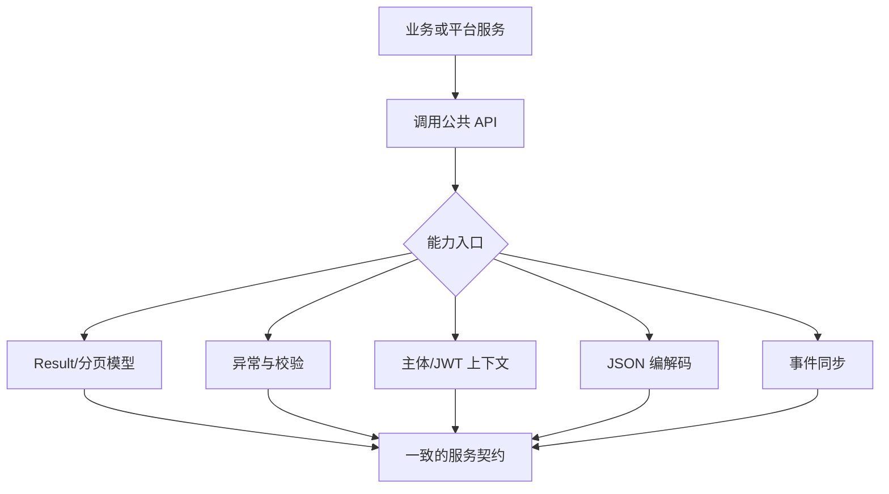

  

# g2rain-common

下一代AI软件开发范式，AI原生Agent平台，开源的企业级SaaS底座。

g2rain 后端公共规范组件，沉淀统一响应与分页模型、异常和错误码体系、JSON 编解码、主体上下文、JWT/DPoP 数据结构、事件同步抽象及通用开发工具；作为平台后端研发支撑层被多个 g2rain 服务复用

[官网](https://www.g2rain.com) · [Issues](https://github.com/g2rain/g2rain/issues) · [Discussions](https://github.com/g2rain/g2rain/discussions)

## 目录

- 项目简介
- 平台定位
- 业务域说明
- 功能概览
- 使用场景
- 核心流程
- 流程图
- 技术栈
- 环境要求
- 快速开始
- 构建与发布
- 代码质量与测试
- 接入与使用示例
- 安全说明
- 与关联仓库的关系
- 模块说明
- 职责边界
- 常见问题
- 关联仓库
- 参与贡献
- 许可证
- 联系我们
- 致谢

## 项目简介

g2rain 后端公共规范组件，沉淀统一响应与分页模型、异常和错误码体系、JSON 编解码、主体上下文、JWT/DPoP 数据结构、事件同步抽象及通用开发工具；作为平台后端研发支撑层被多个 g2rain 服务复用

## 平台定位

该仓库位于 g2rain 后端研发支撑层，为多个后端项目提供集成能力、工程化工具或共享扩展。

## 业务域说明

该仓库聚焦于 `后端公共模型、通用规范、基础抽象与跨服务复用能力`。

核心对象包括：
- Token/DPoP JWT 载荷
- 访问令牌
- 分页数据
- 会话
- 同步事件消息
- 统一响应结果
- 业务异常与错误码
- 应用
- 主体
- 主体上下文
- 字段校验错误

主要流程包括：
- 业务异常到统一 Result 响应的转换流程
- 请求主体上下文的绑定、读取、任务包装与作用域释放流程
- 领域事件的发布、通道选择、消息分发与存储处理流程
- DTO 创建/更新分组校验与字段错误聚合流程

## 功能概览

| 能力 | 说明 |
| --- | --- |
| 统一响应与分页模型 | 通过 Result、PageData、BaseDto、BasePo、BaseVo、SortItem 等类型统一 API 返回、分页、排序和分层数据模型。 |
| 异常与错误码体系 | 通过 ErrorCode、BusinessException、ExceptionProcessor、ExceptionConverter、FieldError 与 SystemErrorCode 统一错误定义、转换和输出。 |
| 错误消息解析与本地化 | 通过 ErrorMessageRegistry、LocalizedErrorMessage、MessageResolver 支持错误消息注册、占位参数解析与多语言扩展。 |
| JSON 编解码 | 通过 JsonCodec、JsonCodecBuilder 和 JsonCodecFactory 统一 Jackson 配置、对象转换、节点查询与条件字段输出。 |
| 数字精度保留 | RawNumberDeserializer 与 RawNumberNode 保留 JSON 数字的原始文本表达，降低大整数或高精度数字转换损失。 |
| 主体与请求上下文 | PrincipalContext、PrincipalContextHolder、PrincipalHeaders 和 ScopedContextHolder 统一承载并传播用户、组织、应用及链路上下文。 |
| Token 与 DPoP 模型 | TokenJWTHeader、TokenJWTPayload、DPoPJWTHeader、DPoPJWTPayload 提供令牌及 DPoP Proof 的公共数据结构。 |
| 事件同步抽象 | EventPublisherHub、EventPublisher、MessageDispatcher、AbstractMessageStorage 等类型定义事件发布、分发与存储扩展链路。 |
| 校验、ID 与通用工具 | 提供创建/更新校验分组、字段错误聚合、ID 生成接口、MapStruct 转换基类以及字符串、集合、时间、数值等工具。 |

## 使用场景

| 场景 | 说明 |
| --- | --- |
| 统一服务 API 返回 | 使用 Result 与 PageData 返回成功、失败和分页结果，保持跨服务响应结构一致。 |
| 建立领域错误规范 | 业务模块实现 ErrorCode、抛出 BusinessException，并通过处理器转换为包含字段错误和本地化消息的统一结果。 |
| 传递认证主体上下文 | 网关、Starter 或服务适配层将请求头解析为 PrincipalContext，并在同步任务或 Callable 中安全传播。 |
| 同步跨节点缓存或领域状态 | 通过事件发布器、消息分发器和消息存储扩展点广播 CREATE、UPDATE、DELETE 等变更。 |
| 统一 JSON 与参数校验行为 | 在服务间复用 JSON 编解码配置、原始数字处理及 Create/Update 分组校验。 |

## 核心流程

| 流程 | 关键步骤 | 代码线索 |
| --- | --- | --- |
| 异常到统一响应 | 业务代码使用 ErrorCode 定义错误 → 抛出 BusinessException 或收集 FieldError → ExceptionProcessor/ExceptionConverter 解析异常 → MessageResolver 处理消息参数 → 输出 Result.error | ErrorCode、BusinessException、DefaultExceptionProcessor、ExceptionConverter、MessageResolver、Result |
| 主体上下文传播 | 适配层根据 PrincipalHeaders 构建 PrincipalContext → 通过 PrincipalContextHolder 绑定作用域 → 业务代码读取用户、组织、应用与链路字段 → 异步任务使用 wrap/runWith/callWith 传播上下文 → 作用域结束后自动释放 | PrincipalHeaders、PrincipalContext、PrincipalContextHolder、ScopedContextHolder |
| 事件发布与分发 | 调用 EventPublisherHub 选择发布通道 → 封装 EventMessage 与 EventType → EventPublisher 发送消息 → MessageDispatcher 解析并路由消息 → 匹配的 AbstractMessageStorage 处理变更 | EventPublisherHub、EventMessage、EventPublisher、DefaultMessageDispatcher、MessageStorageRegistry |
| DTO 分组校验 | 根据 BaseDto.id 判断创建或更新 → 执行 CreateGroup/UpdateGroup 约束 → 补充 Default 组校验 → 将 ConstraintViolation 转换为 FieldError → 存在错误时抛出 BusinessException | Validations、BaseDto、CreateGroup、UpdateGroup、FieldError、SystemErrorCode |

## 流程图

## 技术栈

| 类别 | 说明 |
| --- | --- |
| 运行时 | Java 25 |
| 公共 API 依赖 | Jackson Databind、MapStruct、Jakarta Validation、Swagger Annotations |
| 其他 | Lombok |

## 环境要求

- JDK 25+
- Maven 3.9+

## 快速开始

| 步骤 | 命令或位置 | 说明 |
| --- | --- | --- |
| 准备构建环境 | JDK 25+、Maven 3.9+ | 工具组件通常只需要 Java 与 Maven 构建环境。 |
| 构建组件 | `mvn clean package` | 执行 Maven 构建，生成可发布或可本地安装的组件产物。 |
| 本地安装 | `mvn clean install` | 安装到本地 Maven 仓库，便于业务工程试用依赖。 |

版本号以项目构建配置为准，当前识别为 `1.0.7`。

## 构建与发布

| 目标 | 命令 | 产物 | 说明 |
| --- | --- | --- | --- |
| 组件产物 | `mvn clean package` | `g2rain-common-1.0.7.jar` | 执行 Maven 标准构建，生成可发布的公共库组件产物。 |
| 本地 Maven 安装 | `mvn clean install` | `本地 Maven 仓库产物` | 安装到本地 Maven 仓库，便于业务工程本地验证依赖。 |
| 正式版本发布 | `推送版本 Git Tag` | `Maven Central 正式版本` | release.yml 使用 JDK 25 执行 mvn -B -P release clean deploy，并完成源码包、Javadoc 与 GPG 签名发布。 |
| Snapshot 发布 | `推送 develop 分支的 -SNAPSHOT 版本` | `Sonatype Snapshot 版本` | snapshot.yml 仅在项目版本以 -SNAPSHOT 结尾时执行 mvn -B clean deploy -DskipTests。 |

## 代码质量与测试

| 检查项 | 命令 | 说明 |
| --- | --- | --- |
| Maven Enforcer | `mvn validate` | 约束 JDK 版本、Maven 版本与依赖规则。 |
| Checkstyle | `mvn checkstyle:check` | 检查 Java 代码风格与组织规范。 |
| PMD | `mvn pmd:check` | 执行静态规则检查，识别潜在代码问题。 |
| SpotBugs | `mvn spotbugs:check` | 识别潜在缺陷和风险代码。 |
| JaCoCo | `mvn test jacoco:report` | 运行测试并生成覆盖率报告。 |

## 接入与使用示例

| 示例 | 方式 | 内容 | 说明 |
| --- | --- | --- | --- |
| Maven 依赖引入 | Maven | `<dependency><groupId>com.g2rain</groupId><artifactId>g2rain-common</artifactId><version>1.0.7</version></dependency>` | 在业务工程 pom.xml 中引入该组件。 |
| 返回成功结果 | Java | `Result.success(data)` | 使用统一 Result 包装业务返回数据。 |
| 返回分页结果 | Java | `Result.successPage(pageNum, pageSize, total, records)` | 使用 PageData 结构返回分页数据。 |
| 读取主体上下文 | Java | `PrincipalContext context = PrincipalContextHolder.require()` | 在已绑定请求作用域中读取当前用户、组织、应用与链路信息。 |
| 统一 JSON 编解码 | Java | `JsonCodec codec = JsonCodecFactory.instance()` | 获取默认编解码器，执行对象、字符串、字节数组与 JsonNode 之间的转换。 |
| 执行创建/更新校验 | Java | `Validations.validateSave(dto)` | 根据 DTO 标识选择 CreateGroup 或 UpdateGroup，并聚合字段错误。 |

## 安全说明

| 主题 | 说明 |
| --- | --- |
| 依赖可信边界 | 作为平台共享组件或构建工具，应通过组织 Maven 仓库、版本锁定和发布流程控制依赖来源。 |
| 主体上下文可信边界 | PrincipalContext 只负责承载上下文；外部请求头必须由网关或可信适配层完成认证、过滤和重建，业务服务不应直接信任客户端伪造的 PrincipalHeaders。 |
| JWT/DPoP 职责边界 | TokenJWT* 与 DPoPJWT* 是公共数据结构，不等同于完整的签名、验签或令牌校验实现；安全校验应由 IAM、网关或 Starter 中的专用组件完成。 |
| JSON 输入边界 | 解析不可信 JSON 时仍需限制请求体大小、嵌套深度和允许的目标类型；RawNumber 仅用于保留数字表达，不替代业务范围校验。 |
| ScopedValue 传播 | 异步任务应使用 PrincipalContextHolder 提供的 wrap、runWith 或 callWith 显式传播上下文，避免跨任务读取错误主体。 |

## 与关联仓库的关系

本仓库位于 g2rain 后端研发支撑层，通过 Maven 依赖向 Starter、网关、IAM、基础服务和业务服务提供稳定的公共 API；具体框架装配与运行时实现由 g2rain-spring-boot-starter 等上层组件完成。

## 模块说明

| 模块 | 职责说明 | 代码线索 |
| --- | --- | --- |
| model | 定义 DTO/PO/VO 基类、统一 Result、分页 PageData、下拉选择与排序模型。 | BaseDto、BasePo、BaseVo、Result、PageData、SortItem |
| exception | 定义错误码、业务异常、字段错误、异常转换、默认处理器及消息本地化扩展。 | ErrorCode、BusinessException、ExceptionConverter、DefaultExceptionProcessor、ErrorMessageRegistry |
| json | 封装 Jackson 编解码器、构建器、工厂、条件字段输出和原始数字节点。 | JsonCodec、JsonCodecBuilder、JsonCodecFactory、RawNumberDeserializer、ConditionalPropertyWriter |
| web | 定义主体上下文、标准透传请求头、作用域持有器以及 Token/DPoP JWT Header 与 Payload。 | PrincipalContext、PrincipalContextHolder、PrincipalHeaders、ScopedContextHolder、TokenJWTPayload、DPoPJWTPayload |
| syncer | 定义领域事件发布、通道聚合、消息分发和消息存储注册扩展链路。 | EventPublisherHub、EventPublisher、DefaultMessageDispatcher、AbstractMessageStorage、MessageStorageRegistry |
| validation | 提供 Create/Update 校验分组、DTO 保存场景校验和字段错误聚合。 | Validations、CreateGroup、UpdateGroup、FieldError |
| converter / id / enums | 提供 MapStruct 转换基类、ID 生成接口及组织、会话等公共枚举。 | CommonConverter、IdGenerator、OrganType、SessionType |
| utils | 提供断言、集合、字符串、时间、数值、媒体类型和常量等无框架工具。 | Asserts、Collections、Strings、Moments、Decimals、MediaTypes、Constants |

## 职责边界

该仓库主要负责：
- 负责定义跨服务复用的响应、分页、异常、校验、JSON、主体上下文、JWT/DPoP 数据结构与事件同步公共 API
- 负责提供低耦合扩展契约和无具体业务含义的基础工具，并通过单元测试保持公共行为稳定

该仓库默认不负责：
- 不负责校验外部请求身份、签发或验签令牌，也不应直接信任客户端传入的主体请求头
- 不负责 Spring Bean 自动装配、消息中间件适配、ID 算法实现或具体业务数据持久化
- 不承载任何具体业务域流程，也不作为用户、组织、应用等主数据的权威来源

## 常见问题

| 问题 | 可能原因 | 处理建议 |
| --- | --- | --- |
| 业务工程无法解析依赖 | 组件未发布到当前 Maven 仓库，或 groupId/artifactId/version 配置不一致。 | 检查 Maven 仓库地址、版本号和业务工程 dependencyManagement 配置。 |
| PrincipalContextHolder.require() 报错 | 当前调用不在已绑定 PrincipalContext 的作用域内，或异步任务未传播上下文。 | 在请求适配层使用 runWith/callWith 绑定上下文；提交异步任务前使用 wrap 包装 Runnable 或 Callable。 |
| 校验抛出 PARAM_INVALID | CreateGroup、UpdateGroup 或 Default 组约束未通过。 | 读取 BusinessException 携带的 FieldError 列表，检查字段名、拒绝值和对应校验注解。 |
| JSON 数字精度或输出字段不符合预期 | 未使用项目统一 JsonCodec 配置，或未启用 RawNumber/条件字段相关处理。 | 统一通过 JsonCodecFactory/JsonCodecBuilder 创建编解码器，并核对 RawNumberDeserializer 与 MixIn 配置。 |
| 同步事件未被处理 | 发布通道、dataSource、EventType 或 MessageStorageRegistry 注册不匹配。 | 确认存储扩展已在初始化阶段注册，并核对 EventMessage 的数据源和事件类型。 |

## 关联仓库

| 仓库 | 协作关系 |
| --- | --- |
| g2rain-spring-boot-starter | 通常位于公共组件的上层，复用 g2rain-common 的基础模型、工具能力与工程约定，并进一步封装为 Starter。 |

## 参与贡献

我们欢迎所有形式的贡献：Issue 反馈、文档改进、功能建议与代码提交。

推荐流程：

1. Fork 本仓库。
2. 创建特性分支：`git checkout -b feature/your-feature-name`。
3. 提交更改：`git commit -m "Add some feature"`。
4. 推送分支：`git push origin feature/your-feature-name`。
5. 提交 Pull Request。

代码贡献前请尽量补充必要的测试和文档，并确保构建、测试与静态检查通过。

## 许可证

本项目基于 [Apache 2.0许可证](https://github.com/g2rain/g2rain-common/blob/main/LICENSE) 开源。

## 联系我们

- Issues: [GitHub Issues](https://github.com/g2rain/g2rain/issues)
- 讨论: [GitHub Discussions](https://github.com/g2rain/g2rain/discussions)
- 邮箱: g2rain_developer@163.com

## 致谢

感谢所有为 g2rain 项目提交 Issue、代码、文档、建议和使用反馈的开发者们！
