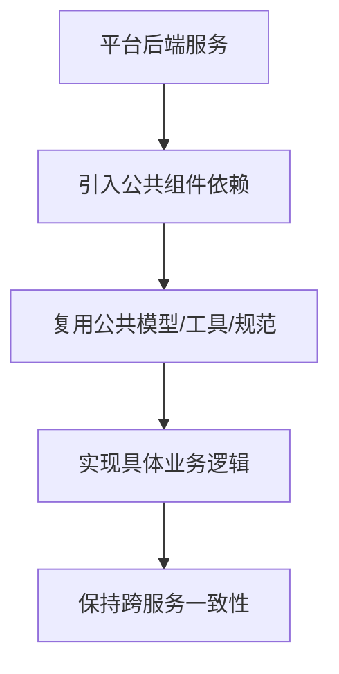



  

# g2rain-common

下一代AI软件开发范式，AI原生Agent平台，开源的企业级SaaS底座。

g2rain 后端公共规范组件，沉淀平台后端通用模型、工具方法、异常规范与工程公共约定；作为平台后端研发支撑层被多个 g2rain 服务复用

[官网](https://www.g2rain.com) · [Issues](https://github.com/g2rain/g2rain/issues) · [Discussions](https://github.com/g2rain/g2rain/discussions)

## 目录

- 项目简介
- 平台定位
- 业务域说明
- 功能概览
- 使用场景
- 核心流程
- 流程图
- 技术栈
- 环境要求
- 快速开始
- 构建与镜像
- 代码质量与测试
- 依赖引入
- 安全说明
- 与关联仓库的关系
- 模块说明
- 职责边界
- 常见问题
- 关联仓库
- 参与贡献
- 许可证
- 联系我们
- 致谢

## 项目简介

g2rain 后端公共规范组件，沉淀平台后端通用模型、工具方法、异常规范与工程公共约定；作为平台后端研发支撑层被多个 g2rain 服务复用

## 平台定位

该仓库位于 g2rain 后端研发支撑层，为多个后端项目提供集成能力、工程化工具或共享扩展。

## 业务域说明

该仓库聚焦于 `后端公共模型、通用规范、基础抽象与跨服务复用能力`。

## 功能概览

| 能力 | 说明 |
| --- | --- |
| 公共模型与规范 | 提供后端服务共享的数据模型、异常结构、响应约定、工具类或基础抽象。 |
| 跨服务复用 | 作为多个后端仓库的基础依赖，降低平台服务之间的重复实现。 |

## 使用场景

| 场景 | 说明 |
| --- | --- |
| 共享后端公共能力 | 当平台服务需要统一响应、异常、基础模型、工具方法或公共抽象时引入。 |
| 减少跨服务重复实现 | 当多个服务存在重复基础代码时，将能力沉淀到公共组件并统一复用。 |

## 核心流程

| 流程 | 关键步骤 | 代码线索 |
| --- | --- | --- |
| 公共组件复用流程 | 后端服务引入公共组件依赖 → 复用模型、异常、响应或工具抽象 → 业务服务按平台约定实现自身逻辑 → 跨服务保持一致的基础行为 | pom.xml、shared packages、common utility/model classes |

## 流程图

## 技术栈

| 类别 | 说明 |
| --- | --- |
| 运行时 | Java 25 |
| 其他 | Lombok |

## 环境要求

- JDK 25+
- Maven 3.9+

## 快速开始

| 步骤 | 命令或位置 | 说明 |
| --- | --- | --- |
| 准备构建环境 | JDK 25+、Maven 3.9+ | 工具组件通常只需要 Java 与 Maven 构建环境。 |
| 构建组件 | `mvn clean package` | 执行 Maven 构建，生成可发布或可本地安装的组件产物。 |
| 本地安装 | `mvn clean install` | 安装到本地 Maven 仓库，便于业务工程试用依赖。 |

版本号以项目构建配置为准，当前识别为 `1.0.7`。

## 构建与镜像

| 目标 | 命令 | 产物 | 说明 |
| --- | --- | --- | --- |
| 组件产物 | `mvn clean package` | `g2rain-common-1.0.7.jar` | 执行 Maven 标准构建，生成可发布的公共库组件产物。 |
| 本地 Maven 安装 | `mvn clean install` | `本地 Maven 仓库产物` | 安装到本地 Maven 仓库，便于业务工程本地验证依赖。 |

## 代码质量与测试

| 检查项 | 命令 | 说明 |
| --- | --- | --- |
| Maven Enforcer | `mvn validate` | 约束 JDK 版本、Maven 版本与依赖规则。 |
| Checkstyle | `mvn checkstyle:check` | 检查 Java 代码风格与组织规范。 |
| PMD | `mvn pmd:check` | 执行静态规则检查，识别潜在代码问题。 |
| SpotBugs | `mvn spotbugs:check` | 识别潜在缺陷和风险代码。 |
| JaCoCo | `mvn test jacoco:report` | 运行测试并生成覆盖率报告。 |

## 依赖引入

| 构建工具 | 配置 | 说明 |
| --- | --- | --- |
| Maven | `<dependency><groupId>com.g2rain</groupId><artifactId>g2rain-common</artifactId><version>1.0.7</version></dependency>` | 在业务工程 pom.xml 中引入该组件。 |

## 安全说明

| 主题 | 说明 |
| --- | --- |
| 依赖可信边界 | 作为平台共享组件或构建工具，应通过组织 Maven 仓库、版本锁定和发布流程控制依赖来源。 |

## 与关联仓库的关系

本仓库位于 g2rain 后端研发支撑层，通过 Maven 依赖为平台后端服务提供公共模型、通用工具和基础规范。

## 模块说明

| 模块 | 职责说明 | 代码线索 |
| --- | --- | --- |
| 公共模型 | 沉淀平台后端通用 DTO、响应、异常、枚举或基础抽象。 | common/model/api/exception packages |
| 通用工具 | 提供跨服务复用的工具方法、常量和工程辅助能力。 | util/support/core packages |

## 职责边界

该仓库主要负责：
- 负责提供后端公共模型、通用工具、异常响应和基础抽象
- 负责支撑多个 g2rain 后端服务复用一致的工程基础能力

该仓库默认不负责：
- 不承载具体业务域流程
- 不作为平台主数据或业务数据的权威来源

## 常见问题

| 问题 | 可能原因 | 处理建议 |
| --- | --- | --- |
| 业务工程无法解析依赖 | 组件未发布到当前 Maven 仓库，或 groupId/artifactId/version 配置不一致。 | 检查 Maven 仓库地址、版本号和业务工程 dependencyManagement 配置。 |

## 关联仓库

| 仓库 | 协作关系 |
| --- | --- |
| g2rain-spring-boot-starter | 通常位于公共组件的上层，复用 g2rain-common 的基础模型、工具能力与工程约定，并进一步封装为 Starter。 |

## 参与贡献

我们欢迎所有形式的贡献：Issue 反馈、文档改进、功能建议与代码提交。

推荐流程：

1. Fork 本仓库。
2. 创建特性分支：`git checkout -b feature/your-feature-name`。
3. 提交更改：`git commit -m "Add some feature"`。
4. 推送分支：`git push origin feature/your-feature-name`。
5. 提交 Pull Request。

代码贡献前请尽量补充必要的测试和文档，并确保构建、测试与静态检查通过。

## 许可证

本项目基于 [Apache 2.0许可证](https://github.com/g2rain/g2rain-common/blob/main/LICENSE) 开源。

## 联系我们

- Issues: [GitHub Issues](https://github.com/g2rain/g2rain/issues)
- 讨论: [GitHub Discussions](https://github.com/g2rain/g2rain/discussions)
- 邮箱: g2rain_developer@163.com

## 致谢

感谢所有为 g2rain 项目提交 Issue、代码、文档、建议和使用反馈的开发者们！
