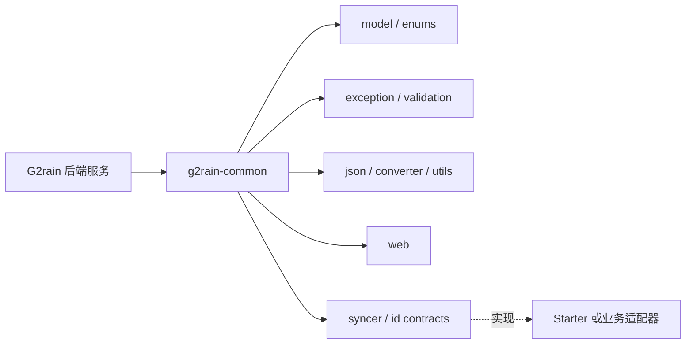

# 架构总览

`g2rain-common` 是不启动服务的单模块 JAR，为 G2rain 后端项目提供稳定、低耦合的共享契约。中央架构仓库当前只有 `java-domain-service`、`frontend-app` 和 `frontend-shell` Profile，本库采用项目本地 `java-common-library 1.0.0-local`，等待未来中央公共库 Profile。

设计原则是“共享契约，不共享领域实现”：公共模型和 SPI 可由业务服务依赖，具体数据库、框架启动、消息通道、身份认证与领域规则留在相应服务或 starter。

